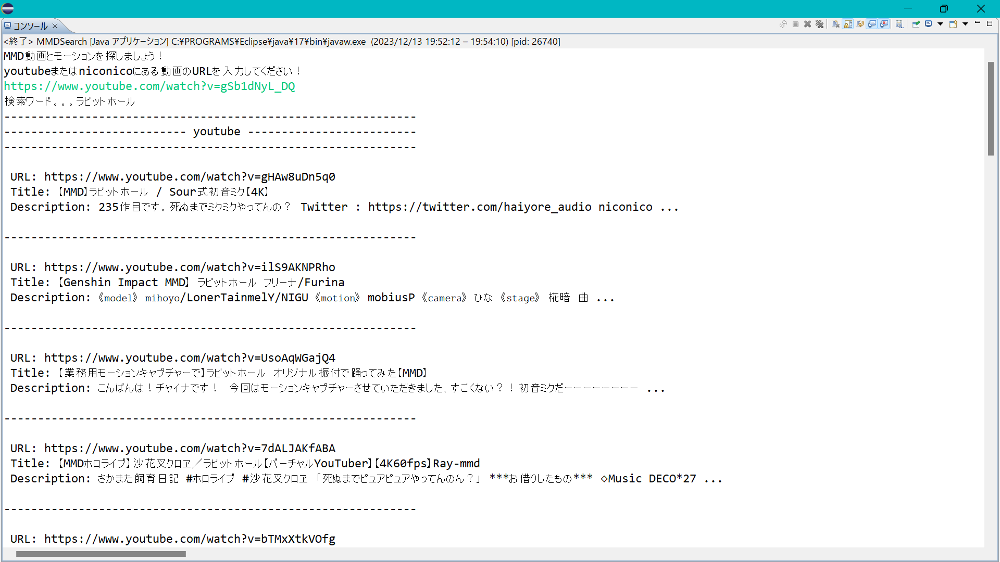
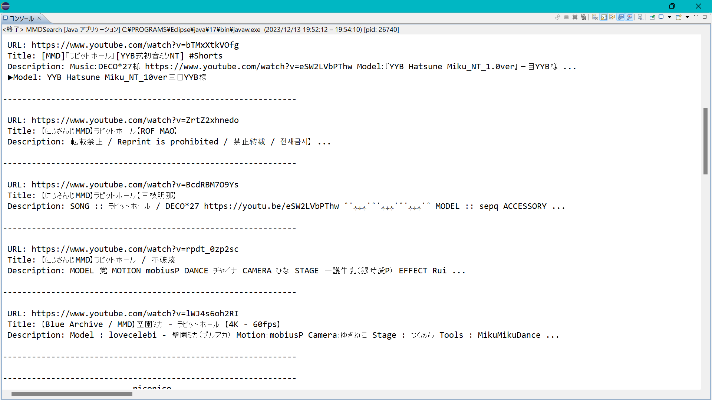
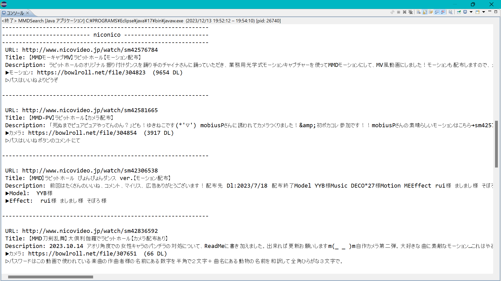
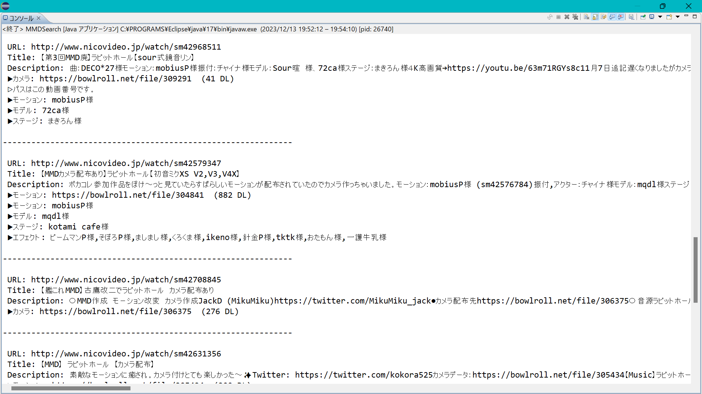
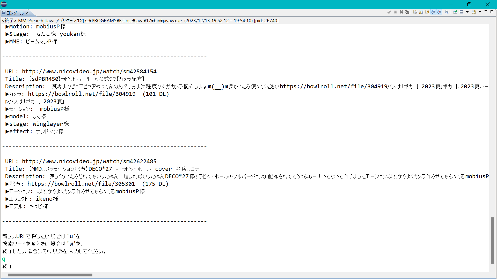

# MMD素材・動画取得プログラム

## 1.	はじめに
サークルの活動の1つでもあるMMD(MikuMikuDance)の制作にあたって、素材集めは面倒な作業である。 
時間の限られるライブ制作時、1つURLを入力するだけでこの作業が効率的に行うことができれば役立つと考えてこのような着想に至った。

## 2.	プログラムの設計と実装
### 実現した機能
入力したURLの曲から本家動画のURL等を出力し、その曲のMMD動画と制作素材の配布を一覧で表示するプログラム。 
YouTubeとニコニコ動画に対応し、出力についてはYouTubeはMMD関連動画が、ニコニコ動画はMMD素材配布動画が表示される。 
１プラットフォーム最大10件表示される。本家動画と判断したもの同タイトルのものが結果に含まれていた場合除外され、９件となる可能性がある。 
使用方法 
まずコンソールの文章に従ってURLを入力する。URLはyoutube, niconicoのどちらか且つ曲の動画である必要がある。適したURLでなかった場合再度入力を求める文章が表示されるので、再び入力できる。 
結果の出力が終わったら、表示された文字列に従ってアルファベットのコマンドを入力する。検索ワードを変える場合はwを、２つ目のURLを入力する場合はuを、終了する場合はそれ以外のキーを入力することでこれらの処理ができる。 

### システムが利用するリソース
【1】 
名称：YouTube Data API 
概要：Youtubeの動画に関する情報の取得、検索を行えるAPI 
利用目的：youtubeにある動画の詳細情報の取得、キーワード検索 
URL：https://www.googleapis.com/youtube/v3/ 
形式：Webサービス 
	パラメータ：kind, videoId, title, description, channelTitle(チャンネル名) 
	レスポンス構造：JSON 

【2】 
名称：スナップショット検索API v2 
概要：ニコニコ動画から、キーワードによる動画検索、動画の再生数などの情報を取得 
利用目的： 
URL：https://api.search.nicovideo.jp/api/v2/snapshot/video/contents/ 
形式：Webサービス 
	パラメータ：q(検索ワード), targets(検索対象のフィールド), fields(レスポンスに含むコンテンツのフィールド), filters, _sort(順番), _limit(レスポンスコンテンツの最大数) 
	レスポンス構造：JSON 

【3】 
名称：getthumbinfo 
概要：ニコニコ動画にある動画のチャンネル名やコメントなど、詳細な動画情報を取得 
利用目的：動画IDから動画のタイトル、概要欄、投稿者名を取得する 
URL：http://ext.nicovideo.jp/api/getthumbinfo/ 
形式：Webサービス 
	パラメータ：title, description, user_nickname(投稿者名) 
	レスポンス構造：XML 

【4】 
名称：BowlRoll 
概要：動画、画像、音楽、ゲームの作品公開、及び制作素材の配布場所を提供するサイト 
利用目的：見つけたこのサイトの素材リンクから、その素材のダウンロード数を取得する 
URL：https://bowlroll.net/ 
形式：動的なWebページ 

## ライブラリ、外部ツールのバージョン
Javaのバージョン：Java17 
OS：Windows11 
- google-api-services-youtube：v3-rev222-1.25.0
- jackson-databind：2.13.0
- jackson-core：2.13.0
- guava：31.0.1-jre
- selenium-java：4.16.0
- slf4j-simple：1.7.32

## 実行結果

## 機能の考察
YouTubeとniconicoの2サービスを横断して検索することで、単独のサービスよりも格段に多くの欲しい情報が得られる機能になっていると思う。 
素材情報の出力に関して、素材制作者だけでなくその人のチャンネルリンクやHPを記載できるようにすると、更に効率よく素材を集めることが出来たと感じている。 
niconicoにて、より正確な本家動画/素材動画を取得するためにコンテンツツリーと呼ばれる関連動画の取得ができる機能があると、更に多くの素材がURLというベストな形で出力できた。 
入力動画のタイトルから検索するのではなく、概要欄から本家動画を見つけてそのタイトルから曲名を推察し検索するという順序を踏むことで、本当に探したい曲の情報が検索できているかの確認と同時に、高精度な検索結果が出せる処理になったと思う。 
概要欄から素材情報を取り出す際の正規表現が、概要欄の書かれ方によっては漏れが生じやすい。正規表現を工夫しているためある程度対応が可能なよう改良してあるが、今以上に様々な書かれ方に対応して出力されるように考えたい。 
曲のタイトル推測にて、正規表現でよくある動画タイトルの形式を踏まえた抽出を行ったが、音楽ストリーミングサービス等のAPIを利用して検索し、正式な曲名を取得することで更に高精度な推測ができたと感じている。

